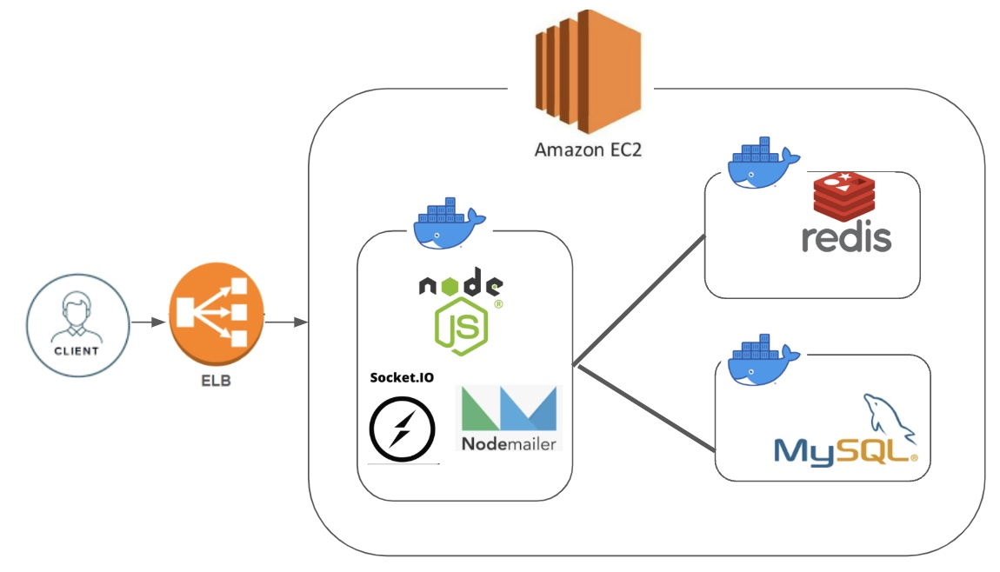
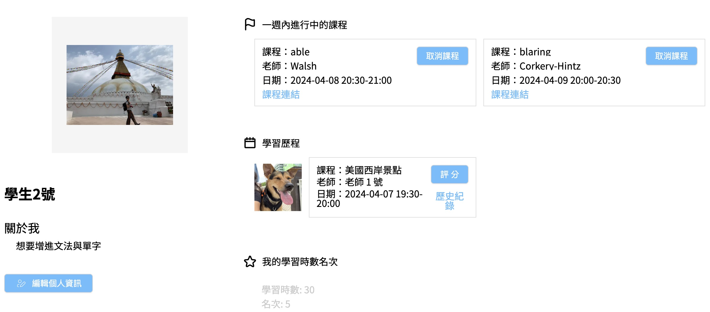
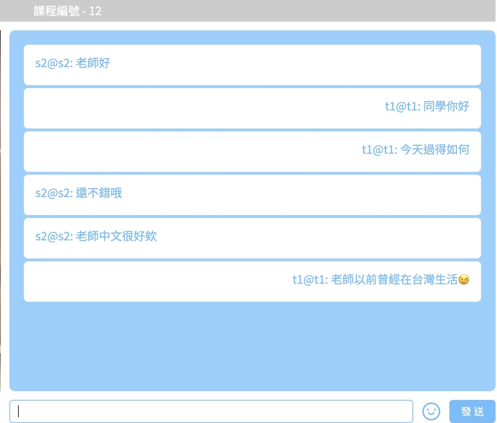
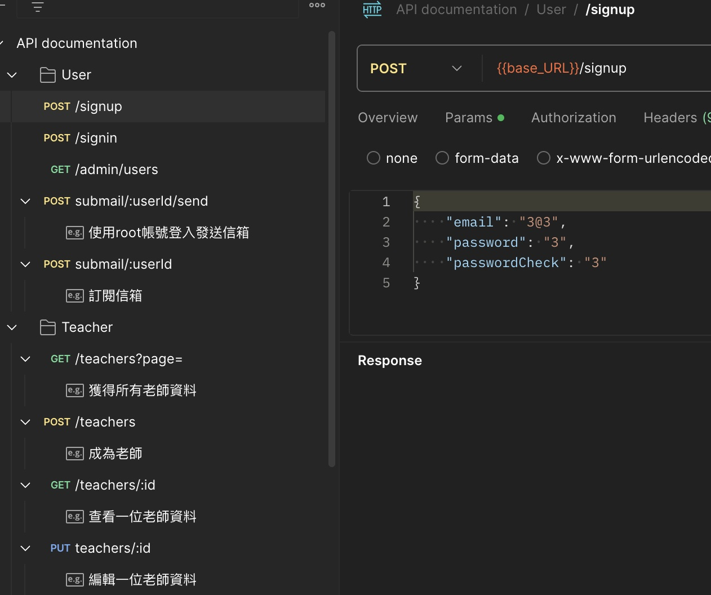

# 家教媒合平台
#### [前端網頁入口](https://tutoring-platform-becky.vercel.app/signin) 
[後端api入口](https://tutor-online2024wb.uk)

每個使用者都能成為老師或學生，老師依據不同種類開設課程，建立兩週內開的課程讓學生預訂．課程連結會啟動 1-1 聊天功能 （需建立學生與老師帳號各一個），學生上完課能評分老師與留言，並且累積學習時數與其他學生比較．root帳號能發送英文電子報給訂閱的人，藉此提升語文能力

🟡 root帳號僅供看後台與發電子報
```
帳號：root@example.com
```
```
密碼：12345678
```

#### RESTful API server 架構圖





### 測試後端API
⚠️鏡像檔只允許操作在Mac（linux/arm64/v8）系統上

1.依照測試環境安裝好 [Docker](https://docs.docker.com/desktop/install/mac-install/) ，並啟動 Docker． 

2.git clone檔案，在 docker-compose.yaml目錄下終端機輸入下方，啟動 app、MySQL與Redis
```
docker docker-compose up
```
3.等候一下，當終端機出現以下訊息代表成功
```
server listening on http://localhost:3000
```
3.下載Postman [json檔](https://drive.google.com/file/d/1_vSTR1a3xlGvCzlGo9IqLQQ_Ch7fXcdf/view?usp=sharing)，測試註冊、登入、訂閱電子報、發送電子報與成為老師的功能，留意Postman環境變數內新增base_URL為http://localhost:3000 ，新增tutor_token環境變數，放入登入成功後的token



4.若要終止程式，終端機輸入結束Docker容器
```
docker docker-compose stop
```
5.需再次啟動容器，注意！先將 docker-compose.yaml 內 command"npm run dbmigrate"移除，輸入下方啟動，使資料庫內容不會重新migrate
```
docker docker-compose start
```
### 環境依賴
  -  "faker-js/faker": "^8.4.1"
  -  "axios": "^1.6.8"
  -  "bcryptjs": "^2.4.3"
  -  "dayjs": "^1.11.10"
  -  "dotenv": "^16.4.4"
  -  "express": "^4.18.2"
  -  "express-session": "^1.18.0"
  -  "google-auth-library": "^9.6.3"
  -  "googleapis": "^134.0.0"
  -  "jsonwebtoken": "^9.0.2"
  -  "multer": "^1.4.5-lts.1"
  -  "mysql2": "^3.2.0"
  -  "nodemailer": "^6.9.13"
  -  "passport": "^0.7.0"
  -  "passport-jwt": "^4.0.1"
  -  "passport-local": "^1.0.0"
  -  "redis": "^4.6.13"
  -  "sequelize": "^6.30.0"
  -  "sequelize-cli": "^6.6.0"
  -  "socket.io": "^4.7.4"